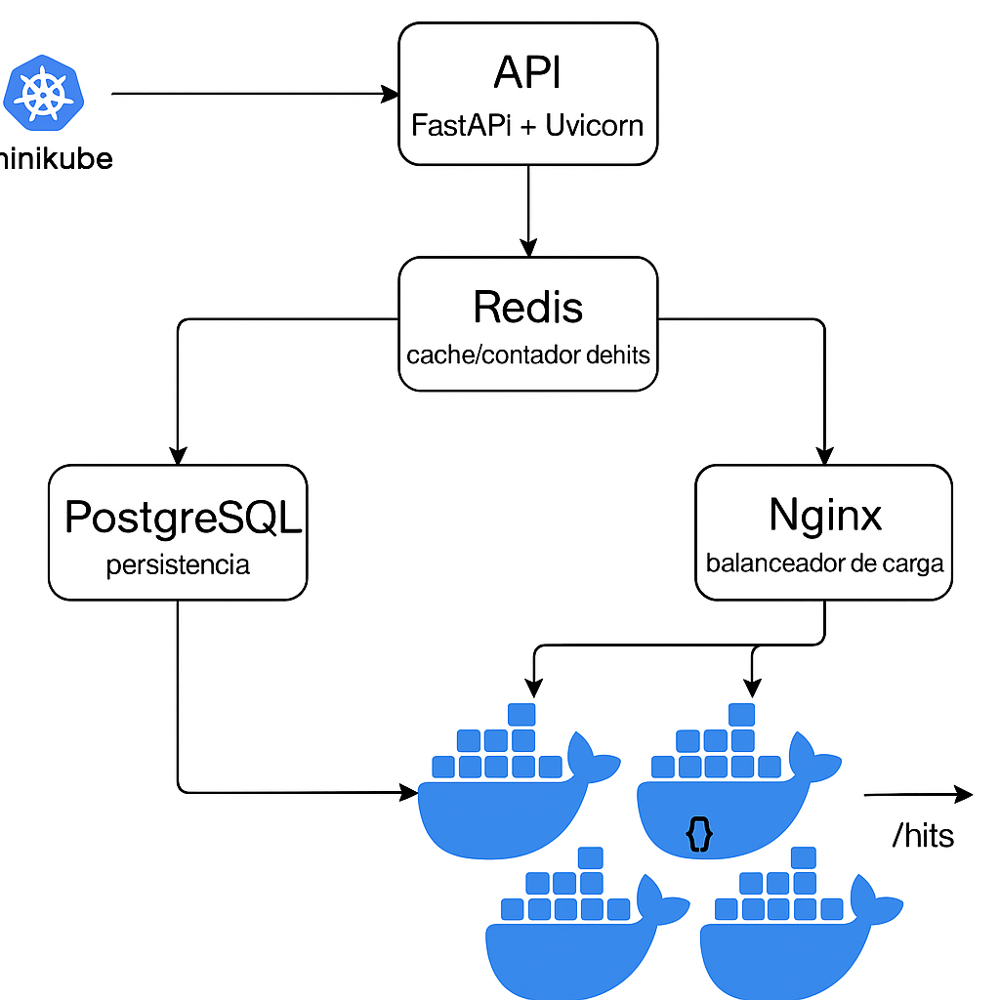

# 🐳 FastAPI K8s App – Sistema Distribuido con Minikube



Este proyecto implementa una arquitectura de microservicios distribuida usando **FastAPI**, **Redis**, **PostgreSQL**, y **Nginx**, desplegados sobre un clúster de **Kubernetes en Minikube**.

---

## 📦 Componentes del sistema

| Componente   | Función                                                  |
|--------------|----------------------------------------------------------|
| FastAPI + Uvicorn | API stateless con endpoints `/` y `/db`              |
| Redis        | Almacenamiento en caché y contador de visitas            |
| PostgreSQL   | Base de datos para persistencia                          |
| Nginx        | Balanceador de carga para múltiples réplicas             |

---

## 📁 Estructura del proyecto

```
fastapi_k8s_app/
├── app/
│   └── main.py                # Código de la API FastAPI
├── k8s/
│   ├── app.yaml               # Despliegue y servicio para FastAPI
│   ├── redis.yaml             # Redis deployment + service
│   ├── postgres.yaml          # PostgreSQL deployment + PVC + service
│   └── nginx.yaml             # Configuración balanceador Nginx
├── Dockerfile                 # Imagen personalizada para FastAPI
├── build_and_reload.sh        # Script de despliegue sin Docker Desktop
└── README.md                  # Este archivo
```

---

## 🚀 Cómo desplegar

### Requisitos:

- [ ] Docker Desktop (opcional)
- [x] Minikube
- [x] kubectl

### 1. Inicia Minikube

```bash
minikube start
```

### 2. Construye la imagen dentro de Minikube

```bash
minikube image build -t fastapi-app:latest .
```

> 💡 Si usas Docker Desktop y no estás en entorno multinodo, puedes usar `docker build` + `minikube image load`.

### 3. Despliega todos los servicios

```bash
kubectl apply -f k8s/
```

### 4. Verifica el estado de los pods

```bash
kubectl get pods
```

### 5. Obtén la URL pública para acceder a la app

```bash
minikube service nginx --url
```

---

## 🔄 Escalabilidad y tolerancia a fallos

### Escalar horizontalmente:

```bash
kubectl scale deployment fastapi-app --replicas=5
```

### Simular caída de una réplica:

```bash
kubectl delete pod <nombre-del-pod>
```

Nginx seguirá balanceando entre las réplicas disponibles.

---

## 📬 Endpoints disponibles

- `GET /` → Retorna mensaje y contador de visitas desde Redis
- `GET /db` → Verifica conexión con PostgreSQL

---

## 🧼 Limpieza

```bash
kubectl delete -f k8s/
```

---


---

## 🛡️ Pruebas de Resiliencia

Estas pruebas permiten validar la tolerancia a fallos y el comportamiento del sistema cuando ocurren interrupciones en los componentes críticos.

### 🔧 Opción A – Simular caída de NGINX (Pod)

Elimina el pod de NGINX manualmente:

```bash
kubectl delete pod -l app=nginx
```

Esto simula una falla inesperada. Kubernetes automáticamente levantará un nuevo pod gracias al Deployment.

Monitorea su recreación:

```bash
kubectl get pods -l app=nginx -w
```

> ✅ Recomendado para probar auto-recuperación sin perder el recurso de servicio.

---

### 🔧 Opción B – Escalar NGINX a 0 (simular mantenimiento)

```bash
kubectl scale deployment nginx --replicas=0
```

Para restaurar el servicio:

```bash
kubectl scale deployment nginx --replicas=1
```

> 🔁 Útil para mantenimiento controlado o despliegues sin tráfico.

---

### ❌ Opción NO recomendada – Eliminar el servicio de NGINX

```bash
kubectl delete svc nginx
```

> ⚠️ Esto elimina el balanceador de carga y la URL pública de Minikube dejará de funcionar. Solo usar si deseas reconfigurar el servicio desde cero.

---

### 🧪 Recomendaciones

- Realiza las pruebas con múltiples réplicas de `fastapi-app` activas.
- Verifica que la API sigue respondiendo tras la recuperación.
- Usa herramientas como `curl` o un navegador para observar interrupciones mínimas.
- Monitorea los pods en tiempo real para observar la auto-recuperación.

```bash
kubectl get pods -w
```


## 👨‍💻 Autor

**Jaider Reyes** – DevOps & Cloud Enthusiast  
GitHub: [@jaiderreyes](https://github.com/jaiderreyes)

---

## ⚖️ Licencia

Este proyecto está bajo la licencia MIT.